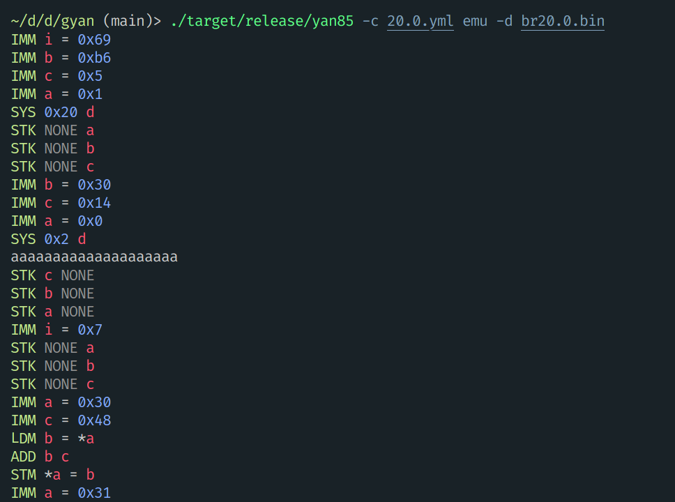

# gyan

Tooling for the [yan85](https://dojo.pwn.college/program-security/reverse-engineering) architecture from [pwn.college](https://pwn.college).



## Installation

No packages or binaries are currently available, but you can clone this repository and build with:

```sh
cargo build --release
```

You can then use the binary at `./target/release/yan85`.

## Usage

gyan's emulator and disassembler features operate on files that contain raw yan85 bytes.

Since opcodes change from level-to-level, gyan supports reading opcodes from a yaml file via the `-c` flag. See [`constants.yml`](constants.yml) for an example.

### Emulator

```sh
yan85 -c 20.0.yml emu -d br20.0.bin
```

### Disassembler

```sh
yan85 -c 20.0.yml disasm br20.0.bin
```

### Assembler

Work-in-progress.

## License

[MIT license](./LICENSE).
